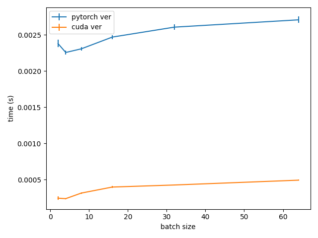

# Pure-Pytorch implementation of Deformable Convolution

Back in 2022, I had a personal project which used [Differentiable Binarization](https://arxiv.org/abs/1911.08947) to detect the ancient Chinese in images. After training the model, I wanted to deploy it to a server for demonstration purpose, using only CPU. However, the [original codebase](https://github.com/MhLiao/DB) of DB, which uses deformable conv as layers in the networks, did not support running on CPU. I delved into the codebase of Deformable conv and discovered that it was  [written in cuda](https://github.com/chengdazhi/Deformable-Convolution-V2-PyTorch), so I wrote my own implementation using pure Pytorch, translated from the cuda code. 

This implementation is compatible with the original cuda version, so that after training with the cuda version, the trained weights can be loaded into this Pytorch version and the two versions will output exactly the same without additional tunning. I was able to run BD on my personal computer without a cuda device thanks to this.
<!-- The early version of this code, thanks to which I was able to run DB on my personal computer without a cuda device, is left dormant on kaggle for years.  -->

Fast forward two years later, and I still have not seen any implementation or repo that support running deformable conv on CPU. `torchvision.ops.deform_conv2d` also requires cuda device to be available.  Therefore,  I decided to make this code into a github repo.


## How to use
If a working PyTorch library is installed, no additional installation is required. Simply copy the `deform_conv.py` file into your project directory. Alternatively, installation is also possible with
```
pip install git+https://github.com/giangbang/Pure-Pytorch-implementation-Deformable-Convolution
```

For usage examples, refer to `examples.py`. The API is similar to `torchvision.ops.deform_conv2d` and `torchvision.ops.DeformConv2d`. Therefore, integrating it into a codebase that already utilizes the CUDA version should be seamless. You may only need to add a checking condition to ensure compatibility with the device being used.
```python
if use_cpu:
    from deform_conv_torch import DeformConv2d, deform_conv2d
elif use_cuda:
    from torchvision.ops import DeformConv2d, deform_conv2d
```

## How efficient is this code?

In testing on the same device (P100 GPU on Kaggle), I observed that the running time of this implementation is roughly five times longer than the CUDA version. Despite efforts to optimize the code for efficiency, executing it via the Python API inherently incurs some overhead compared to running it directly from the CUDA kernel.

As a result, it's recommended to conduct training using the CUDA implementation for optimal performance. However, if running on a CPU during inference is necessary, you may consider switching to use this code.